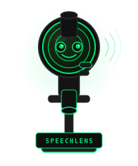

<div align="center">


# SpeechLens

**Transcription that stays on your machine.**

[](LICENSE)
[](https://python.org)
[](https://github.com/openai/whisper)
[](CONTRIBUTING.md)

</div>

---

## The Problem

You have audio files. You want text. Every tool that does this wants your files uploaded to their servers, an account, a credit card, and a subscription you'll forget to cancel.

Your interview recordings. Your lecture notes. Your client calls. None of that should be on a stranger's cloud.

---

## The Fix

SpeechLens runs [OpenAI's Whisper](https://github.com/openai/whisper) locally on your machine and wraps it in a clean browser UI. Drop files in, pick a model, hit run. Transcripts come back in whatever format you need. Nothing leaves your computer. No keys. No accounts. No rate limits.

It's a Python file and an HTML file. That's the whole thing.

---

## Quick Start

**You need ffmpeg first.**

```bash
# Windows
winget install ffmpeg

# Mac
brew install ffmpeg

# Linux
sudo apt install ffmpeg
```

**Then install Python dependencies:**

```bash
pip install openai-whisper flask
```

**Got an NVIDIA GPU? Use it:**

```bash
pip install torch --index-url https://download.pytorch.org/whl/cu128
```

**Pre-download your model (optional, saves time on first run):**

```bash
python -c "import whisper; whisper.load_model('large-v3')"
```

**Run:**

```bash
python app.py
```

Opens at `http://localhost:7331`. That's it.

---

## What It Does

**Transcription**
- Every common audio format: mp3, wav, m4a, mp4, flac, ogg, webm, aac, wma, opus
- 5 Whisper model sizes — tiny through large-v3
- Auto-detects your GPU and uses it. Falls back to CPU if not found
- Detects language automatically or you can force one
- Translation mode — any language transcribed directly to English

**Multi-file workflow**
- Queue as many files as you want
- Drag to reorder before running
- Checkboxes to pick exactly which files to run
- Run All or Run Selected
- Each file tracks its own status independently

**Export formats**
- Plain text `.txt`
- SRT subtitles `.srt`
- WebVTT `.vtt`
- JSON with full segment data `.json`
- Tab-separated `.tsv`
- Merged — combine multiple files into one download with custom separators

**UI stuff that actually matters**
- Editable transcript panel — fix Whisper's occasional weirdness
- Search across every transcript at once
- Timestamped segments view
- Copy or Copy Clean (strips extra whitespace before copying)
- Live metadata: detected language, word count, char count, segment count, time taken

---

## Models

| Model | Size | Speed | Use when |
|---|---|---|---|
| tiny | 39M | Instant | You're testing or don't care about accuracy |
| base | 74M | Fast | Short clips, casual use |
| small | 244M | Moderate | Most things |
| medium | 769M | Slow | Interviews, lectures, anything important |
| large-v3 | 1.5B | Slower | You need it right |

On a modern NVIDIA GPU, large-v3 runs at 30-50x realtime. On CPU it's slower but it works.

---

## Meet Lens 🔬

Lens is the SpeechLens mascot. A microscope that listens.

Lens doesn't care about your audio quality. Doesn't care about your accent. Doesn't care that you recorded a one-hour meeting in a coffee shop with your laptop mic. Lens just looks at your audio and pulls out every word it can find.

Lens believes in your terrible recordings.

---

## File Structure

```
speechlens/
  app.py            backend — Flask server, Whisper worker, all routes
  static/
    index.html      frontend — one file, zero build step
    lens-mascot.svg that's Lens
  uploads/          temp audio files, auto-created, never committed
  README.md
  CONTRIBUTING.md
  CHANGELOG.md
  LICENSE
  .gitignore
```

No build pipeline. No node_modules. No webpack config. If you can run Python you can run this.

---

## Troubleshooting

**Upload failed**
The Python server isn't running. Run `python app.py` first, then open the browser.

**Stuck at 50% in the terminal**
Not stuck. Whisper's progress bar gets uneven on long files. The terminal will print `Done: filename in Xs` when it's actually done. The UI updates automatically after that.

**CUDA not found**
```bash
python -c "import torch; print(torch.cuda.is_available())"
```
If `False`, grab the right PyTorch build at [pytorch.org](https://pytorch.org/get-started/locally/).

**Windows: wrong Python environment**
Use `py -3 app.py` instead of `python app.py`.

**ffmpeg not found**
Install it and restart your terminal so PATH picks it up.

---

## What's Coming

- [ ] Speaker diarization — who said what
- [ ] Audio playback synced to transcript
- [ ] Real progress percentage based on audio duration
- [ ] Batch export all transcripts as a zip
- [ ] Docker image
- [ ] Configurable output directory
- [ ] Light theme (maybe, if people ask)

---

## Contributing

See [CONTRIBUTING.md](CONTRIBUTING.md). PRs are welcome. Keep it simple.

---

## License

MIT. See [LICENSE](LICENSE). Do whatever you want with it.

---

<div align="center">

*Your files don't need to go anywhere to become text.*

**[Report a bug](../../issues) · [Request a feature](../../issues) · [Open a PR](../../pulls)**

</div>
